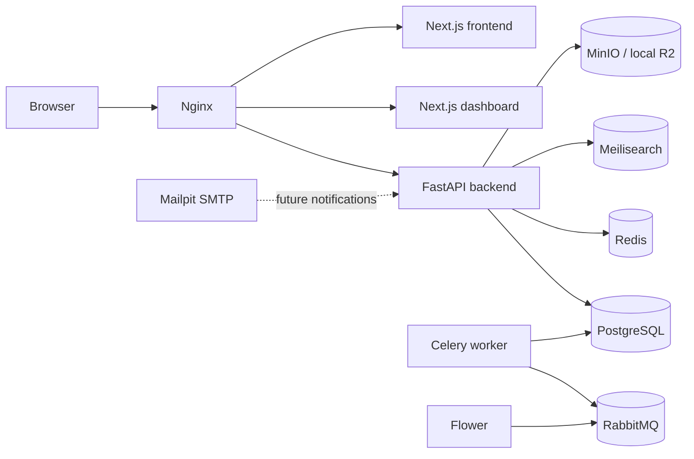

# Fashion Network

Fashion Network is digital inventory infrastructure connecting participating clothing stores in Manipur. Customers discover store-owned inventory across the network; stores retain inventory ownership and fulfill their own reservations. It is not an e-commerce platform.

Phase 1.2 provides a complete, containerized local development environment. It introduces no authentication, business logic, database models, product behavior, inventory behavior, or reservation behavior. The only API route is `GET /health`.

## Local architecture



PostgreSQL is the authoritative future system of record. RabbitMQ is the only Celery broker. Redis is reserved for caching, sessions, rate limiting, temporary reservation locks, and other ephemeral coordination. Meilisearch is a rebuildable search projection. MinIO substitutes for Cloudflare R2 only in local development.

The approved product and architecture documentation remains authoritative in [`docs/`](docs/README.md).

## Prerequisite

Install Docker Desktop or Docker Engine with Docker Compose v2. No host installation of Python, Poetry, Node.js, pnpm, PostgreSQL, Redis, RabbitMQ, or other project services is required.

## Start

Clone the repository, then run:

```text
copy .env.example .env.development
docker compose up
```

On Linux or macOS, use `cp` instead of `copy`. The repository already contains a safe local `.env.development`; copying the example is useful when resetting configuration.

For a detached, build-and-verify bootstrap:

```text
# Windows PowerShell
.\scripts\bootstrap.ps1

# Linux/macOS
./scripts/bootstrap.sh
```

The first start downloads base images and installs pinned dependencies, so it takes longer than subsequent starts. MinIO creates the `fashion-network-media` bucket automatically.

## Services and ports

All published ports bind to loopback only.

| Service         | URL or port                    | Purpose                             |
| --------------- | ------------------------------ | ----------------------------------- |
| Nginx           | `http://localhost`             | Local frontend gateway              |
| Nginx dashboard | `http://dashboard.localhost`   | Dashboard gateway                   |
| Nginx API       | `http://api.localhost`         | Backend gateway                     |
| Frontend        | `http://localhost:3000`        | Direct Next.js development server   |
| Dashboard       | `http://localhost:3001`        | Direct dashboard development server |
| Backend         | `http://localhost:8000`        | Direct FastAPI development server   |
| Swagger UI      | `http://localhost:8000/docs`   | Development API documentation       |
| PostgreSQL      | `localhost:5432`               | Authoritative relational database   |
| Redis           | `localhost:6379`               | Authenticated ephemeral data        |
| RabbitMQ AMQP   | `localhost:5672`               | Celery broker                       |
| RabbitMQ UI     | `http://localhost:15672`       | Broker administration               |
| Meilisearch     | `http://localhost:7700/health` | Search engine API                   |
| MinIO S3 API    | `http://localhost:9000`        | Local object storage API            |
| MinIO Console   | `http://localhost:9001`        | Object storage administration       |
| Flower          | `http://localhost:5555`        | Authenticated Celery monitoring     |
| Mailpit UI      | `http://localhost:8025`        | Captured development email          |
| Mailpit SMTP    | `localhost:1025`               | Local SMTP endpoint                 |

Credentials are the development-only values in `.env.development`. They are intentionally invalid for non-development configuration.

## Environment configuration

Every variable is documented in [`.env.example`](.env.example). Key groups are:

- `FASHION_NETWORK_*`: validated backend settings and service URLs;
- `POSTGRES_*`: local database bootstrap;
- `REDIS_PASSWORD`: authenticated Redis access;
- `RABBITMQ_*`: broker user, password, virtual host, and Celery URL;
- `MEILI_*`: Meilisearch environment and master key;
- `MINIO_*` and `FASHION_NETWORK_S3_*`: local S3 credentials and bucket;
- `FLOWER_*`: Flower basic authentication;
- `MP_*` and `FASHION_NETWORK_SMTP_*`: Mailpit storage and SMTP connection;
- `NEXT_PUBLIC_API_BASE_URL`: browser-visible API gateway.

`.env.production` is a configuration contract containing no real secrets. Production values must come from the selected secret manager and protected deployment environment.

## Development commands

```text
make up          # Build and start in the background
make down        # Stop containers and preserve data
make logs        # Follow recent logs
make restart     # Restart running services
make verify      # Verify every service from the Compose networks
make lint        # Run containerized linters
make typecheck   # Run containerized type checks
make test        # Run containerized tests
make format      # Apply project formatters
make clean       # Stop and permanently delete local named volumes
```

Without GNU Make, run the corresponding commands from the `Makefile`. The main lifecycle commands are:

```text
docker compose up --build --detach
docker compose --profile tools run --rm verify
docker compose logs --follow
docker compose down
```

## Hot reload

The backend bind-mounts `backend/` and runs Uvicorn reload. Each Next.js application bind-mounts its own source tree and enables file polling for Docker Desktop compatibility. Dependency and `.next` directories use named volumes, preventing host/container platform conflicts.

## Cloudflare R2 in production

MinIO is never deployed as the production object store. The production adapter will use the R2-supported S3 subset:

1. Set `FASHION_NETWORK_S3_ENDPOINT_URL` to the account-specific R2 S3 endpoint.
2. Set region to `auto`.
3. Inject R2 access key ID and secret through the production secret manager.
4. Set the pre-provisioned private R2 bucket name.
5. Remove MinIO and its initialization container from the production topology.
6. Run staging contract tests against real R2 because MinIO compatibility is not proof of complete R2 compatibility.

No R2 adapter or upload business workflow is implemented in Phase 1.2.

## Verification

The verifier checks PostgreSQL encoding/timezone, authenticated Redis, RabbitMQ alarms, Meilisearch, MinIO bucket initialization, FastAPI health and Swagger, both Next.js applications, Celery through Flower, Mailpit, and all Nginx routes:

```text
docker compose --profile tools run --rm verify
```

Inspect runtime health with:

```text
docker compose ps
docker compose logs SERVICE_NAME
```

## Troubleshooting

- **A port is already in use:** stop the conflicting local process, then rerun `docker compose up`. Direct application ports remain available if port 80 is occupied.
- **A container remains unhealthy:** run `docker compose ps` and `docker compose logs <service>`.
- **Old credentials fail:** named volumes retain initialized credentials. Run `make clean` only when deleting all local data is acceptable, then start again.
- **Source changes do not reload:** ensure the source folder is shared with Docker Desktop and `WATCHPACK_POLLING=true`.
- **Images or packages fail to download:** verify registry/network access and rerun; builds are cacheable.
- **`dashboard.localhost` does not resolve:** use `http://localhost:3001`, or add a local hosts entry mapping it to `127.0.0.1`.
- **Flower rejects credentials:** use `FLOWER_USER` and `FLOWER_PASSWORD` from `.env.development`.

## Repository workflow

Read [`CONTRIBUTING.md`](CONTRIBUTING.md) and [`docs/git-workflow.md`](docs/git-workflow.md) before changing the repository. Report vulnerabilities privately through [`SECURITY.md`](SECURITY.md).
