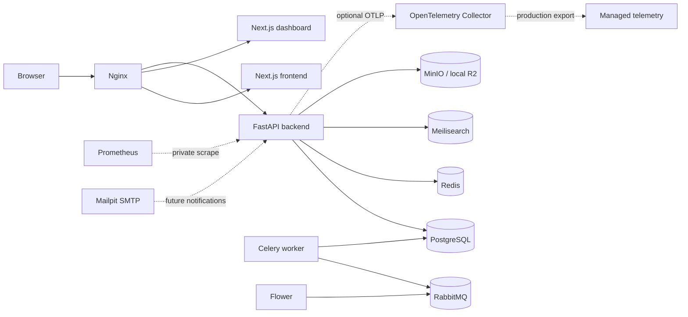

# Fashion Network

Fashion Network is digital inventory infrastructure connecting participating clothing stores in Manipur. Customers discover store-owned inventory across the network; stores retain inventory ownership and fulfill their own reservations. It is not an e-commerce platform.

Phase 1.6 freezes the reviewed, business-neutral engineering foundation.
The foundation includes separate liveness, readiness, and startup probes;
Prometheus metrics; opt-in OpenTelemetry and Sentry; slow request/query and
lifecycle diagnostics; an optional local observability profile;
security/dependency CI; load-test examples; and backup, recovery, resource,
deployment, and incident runbooks. The accepted decisions and review evidence
are recorded in the [ADRs](docs/adr/README.md) and
[architecture freeze review](docs/phase-1.6-architecture-freeze.md).

The frozen foundation remains unchanged. Identity is complete and frozen;
Phases 3.1 through 3.4 introduce the first isolated business bounded context
for owner-scoped Store profiles, verification, staff lifecycle, and Store-only
media.

The Phase 1.4 transport foundations remain unchanged and include disabled-by-default
rate-limiting and conditional-ETag middleware, validated `Idempotency-Key`
contracts, opt-in API deprecation/sunset headers, and adaptive Brotli/GZip
response compression. No rate policy, Redis limiter, idempotency table, or
catalog cache behavior is enabled or implemented prematurely.

Phase 4.3 adds Product Media metadata and storage orchestration using the
existing MinIO-compatible StorageProvider. Product media objects are owned by
the Product/Catalog boundary and presigned download URLs are generated only at
request time.

## Local architecture



PostgreSQL is the authoritative future system of record. RabbitMQ is the only Celery broker. Redis is reserved for caching, sessions, rate limiting, temporary reservation locks, and other ephemeral coordination. Meilisearch is a rebuildable search projection. MinIO substitutes for Cloudflare R2 only in local development.

The approved product and architecture documentation remains authoritative in [`docs/`](docs/README.md).

The Identity foundation implemented in Phases 2.1 through 2.5 is production
hardened and frozen by the
[Phase 2.6 review](docs/phase-2.6-identity-freeze.md). New business modules
consume its stable interfaces without extending Identity behavior.

The [Phase 3.1 Store Domain](docs/phase-3.1-store-domain.md) documents Store
profile persistence, owner-scoped CRUD, lifecycle states, permissions, events,
metrics, migration, and the strict boundary before Store Verification.

The [Phase 3.2 Store Verification](docs/phase-3.2-store-verification.md)
implements owner submission, administrative review, approval/rejection,
reopening, and atomic Store lifecycle synchronization without adding uploads,
staff, catalog, inventory, or commerce behavior.

The [Phase 3.3 Store Staff Management](docs/phase-3.3-store-staff-management.md)
adds Store-local membership persistence, invitations, acceptance/decline,
suspension/reactivation, removal, database invariants, events, and metrics.
Identity remains frozen, ownership transfer is excluded, and no catalog,
inventory, media, or commerce behavior is introduced.

The [Phase 3.4 Store Media](docs/phase-3.4-store-media.md) adds validated
Store-only logo, banner, and gallery images through the approved private
MinIO/R2 abstraction. PostgreSQL remains authoritative for lifecycle metadata;
object mutations use rollback compensation; and no product media, workers,
CDN, frontend, or generic upload API is added.

Phase 4.0 introduces the Store-owned Catalog foundation. Catalog metadata,
ownership scoping, lifecycle validation, optimistic locking, soft deletion,
safe events, and permissions are documented in
[`docs/phase-4.0-catalog-foundation.md`](docs/phase-4.0-catalog-foundation.md).
Products, variants, pricing, inventory, and reservations remain out of scope.

Phase 4.1 adds Store-scoped Products inside Catalogs with lifecycle,
optimistic locking, SKU/slug uniqueness, and permission-protected CRUD. See
[`docs/phase-4.1-product-foundation.md`](docs/phase-4.1-product-foundation.md).

Phase 4.5 adds the Inventory Foundation: one PostgreSQL-authoritative inventory
record per Product Variant, derived available quantity, tenant-scoped CRUD,
optimistic locking, and safe inventory events. Reservations, movements, and
public availability projections remain outside scope. See
[`docs/phase-4.5-inventory-foundation.md`](docs/phase-4.5-inventory-foundation.md).

Phase 4.6 adds Product Pricing as a bounded context separate from Product, with
decimal Money validation, multi-currency-ready effective periods, lifecycle,
owner-scoped CRUD, optimistic locking, audit attribution, safe events, and metrics.
See [`docs/phase-4.6-product-pricing.md`](docs/phase-4.6-product-pricing.md).

Phase 4.7 adds Store-owned Price Lists, strict ISO-4217 multi-currency selection,
scheduled and customer-group pricing, assignments, and deterministic resolution
without promotions or currency conversion. See
[`docs/phase-4.7-price-lists-and-multi-currency.md`](docs/phase-4.7-price-lists-and-multi-currency.md).

Phase 4.8 replaces temporary Product Variant JSONB attributes with Store-owned
attribute definitions, controlled values, normalized Variant assignments, and
deterministic combination signatures. Every Variant mutation now writes an
identifier-only event to a transactional PostgreSQL outbox; publication remains
deferred. See
[`docs/phase-4.8-variant-attribute-normalization.md`](docs/phase-4.8-variant-attribute-normalization.md).

Phase 5.0 adds customer-owned, Store-scoped Shopping Carts with quantity
management, immutable price snapshots, validation-only Inventory checks,
optimistic locking, soft deletion, transactional outbox events, and summaries.
It does not reserve stock or implement checkout, Orders, tax, shipping, payments,
conversion, or coupons. See
[`docs/phase-5.0-shopping-cart-foundation.md`](docs/phase-5.0-shopping-cart-foundation.md).

Phase 5.1 adds customer-owned Checkout Sessions that revalidate active Cart Items
through production Pricing and Inventory, freeze immutable commercial snapshots,
and support confirmation, expiration, and cancellation. Confirmation prepares a
future Order handoff without reserving stock, creating an Order, or processing a
payment. See
[`docs/phase-5.1-checkout-foundation.md`](docs/phase-5.1-checkout-foundation.md).

Phase 5.2 adds customer-owned, Store-scoped Orders as immutable commercial
contracts created only from confirmed Checkout Sessions. Orders copy frozen
Checkout snapshots, enforce a one-way lifecycle and optimistic versions, and do
not process Payments or mutate Inventory. See
[`docs/phase-5.2-order-foundation.md`](docs/phase-5.2-order-foundation.md).

Phase 5.3 adds customer-owned Payment Intents for pending Orders, a provider-neutral
gateway protocol, deterministic Null gateway, idempotent creation, append-only
provider transactions, and capture-driven Order confirmation. It performs no real
financial transaction, Inventory mutation, refunds, settlements, invoicing, or
fulfillment. See
[`docs/phase-5.3-payment-foundation.md`](docs/phase-5.3-payment-foundation.md).

Phase 5.4 adds customer-owned Inventory Reservations for captured Payments. Active
Reservations hold capacity through immutable Reservation Items, row-locked
validation, lazy expiration, release, and consumption while leaving every Inventory
quantity unchanged. See
[`docs/phase-5.4-inventory-reservation.md`](docs/phase-5.4-inventory-reservation.md).

Phase 5.5 adds customer-owned Shipments for consumed Reservations. It manages
packages, deterministic carrier labels, tracking history, optimistic fulfillment
transitions, transactional events, and dispatch-time Inventory consumption through
the production Inventory service. See
[`docs/phase-5.5-shipment-fulfillment.md`](docs/phase-5.5-shipment-fulfillment.md).

Phase 5.6 adds customer-owned Returns and provider-neutral Refunds for delivered
Shipments. It validates cumulative refundable quantities, records inspection
dispositions without restocking, and processes deterministic Null refunds through
transactional lifecycle and event contracts. See
[`docs/phase-5.6-returns-refund-foundation.md`](docs/phase-5.6-returns-refund-foundation.md).

Phase 5.7 adds Store-scoped Promotions and Coupons with deterministic eligibility,
stacking, usage limits, and optimistic lifecycle management. Cart evaluation is
non-mutating, Checkout freezes immutable Redemption snapshots, and Orders inherit
those snapshots without recalculation. See
[`docs/phase-5.7-promotions-discount-engine.md`](docs/phase-5.7-promotions-discount-engine.md).

## Prerequisite

Install Docker Desktop or Docker Engine with Docker Compose v2. No host installation of Python, Poetry, Node.js, pnpm, PostgreSQL, Redis, RabbitMQ, or other project services is required.

## Start

Clone the repository, then run:

```text
copy .env.example .env.development
docker compose up
docker compose run --rm backend alembic upgrade head
```

On Linux or macOS, use `cp` instead of `copy`. The repository already contains a safe local `.env.development`; copying the example is useful when resetting configuration.

For a detached, build-and-verify bootstrap:

```text
# Windows PowerShell
.\scripts\bootstrap.ps1

# Linux/macOS
./scripts/bootstrap.sh
```

The first start downloads base images and installs pinned dependencies, so it takes longer than subsequent starts. MinIO creates the `fashion-network-media` bucket automatically.

## Services and ports

All published ports bind to loopback only.

| Service         | URL or port                            | Purpose                             |
| --------------- | -------------------------------------- | ----------------------------------- |
| Nginx           | `http://localhost`                     | Local frontend gateway              |
| Nginx dashboard | `http://dashboard.localhost`           | Dashboard gateway                   |
| Nginx API       | `http://api.localhost`                 | Backend gateway                     |
| Frontend        | `http://localhost:3000`                | Direct Next.js development server   |
| Dashboard       | `http://localhost:3001`                | Direct dashboard development server |
| Backend         | `http://localhost:8000`                | Direct FastAPI development server   |
| Swagger UI      | `http://localhost:8000/docs`           | Development API documentation       |
| Liveness        | `http://localhost:8000/health/live`    | Process-only probe                  |
| Readiness       | `http://localhost:8000/health/ready`   | Required dependency probe           |
| Startup         | `http://localhost:8000/health/startup` | Initialization probe                |
| Metrics         | `http://localhost:8000/metrics`        | Private Prometheus exposition       |
| PostgreSQL      | `localhost:5432`                       | Authoritative relational database   |
| Redis           | `localhost:6379`                       | Authenticated ephemeral data        |
| RabbitMQ AMQP   | `localhost:5672`                       | Celery broker                       |
| RabbitMQ UI     | `http://localhost:15672`               | Broker administration               |
| Meilisearch     | `http://localhost:7700/health`         | Search engine API                   |
| MinIO S3 API    | `http://localhost:9000`                | Local object storage API            |
| MinIO Console   | `http://localhost:9001`                | Object storage administration       |
| Flower          | `http://localhost:5555`                | Authenticated Celery monitoring     |
| Mailpit UI      | `http://localhost:8025`                | Captured development email          |
| Mailpit SMTP    | `localhost:1025`                       | Local SMTP endpoint                 |

The optional `observability` profile adds Prometheus on port `9090`, Grafana on
port `3002`, OTLP on ports `4317`/`4318`, and collector health on `13133`.
These ports are loopback-only, and `/metrics` is blocked by the Nginx gateway.

Credentials are the development-only values in `.env.development`. They are intentionally invalid for non-development configuration.

## Environment configuration

Every variable is documented in [`.env.example`](.env.example). Key groups are:

- `FASHION_NETWORK_*`: validated backend settings and service URLs;
- `POSTGRES_*`: local database bootstrap;
- `REDIS_PASSWORD`: authenticated Redis access;
- `RABBITMQ_*`: broker user, password, virtual host, and Celery URL;
- `MEILI_*`: Meilisearch environment and master key;
- `MINIO_*` and `FASHION_NETWORK_S3_*`: local S3 credentials and bucket;
- `FLOWER_*`: Flower basic authentication;
- `MP_*` and `FASHION_NETWORK_SMTP_*`: Mailpit storage and SMTP connection;
- `NEXT_PUBLIC_API_BASE_URL`: browser-visible API gateway.

`.env.production` is a configuration contract containing no real secrets. Production values must come from the selected secret manager and protected deployment environment.

## Development commands

```text
make up          # Build and start in the background
make down        # Stop containers and preserve data
make logs        # Follow recent logs
make restart     # Restart running services
make verify      # Verify every service from the Compose networks
make migrate     # Apply the ordered Alembic history
make migration-check # Check metadata against the current schema
make lint        # Run containerized linters
make typecheck   # Run containerized type checks
make test        # Run containerized tests
make format      # Apply project formatters
make clean       # Stop and permanently delete local named volumes
```

Without GNU Make, run the corresponding commands from the `Makefile`. The main lifecycle commands are:

```text
docker compose up --build --detach
docker compose run --rm backend alembic upgrade head
docker compose --profile tools run --rm verify
docker compose logs --follow
docker compose down
```

For local dashboards and trace export:

```text
docker compose --profile observability up --detach
```

## Hot reload

The backend bind-mounts `backend/` and runs Uvicorn reload. FastAPI lifespan creates one asyncpg SQLAlchemy pool, validates PostgreSQL and migration status at startup, and disposes the pool during graceful shutdown. Each request receives one automatically closed async session; application service boundaries own successful commits, exceptions trigger rollback, and repositories never commit. Each Next.js application bind-mounts its own source tree and enables file polling for Docker Desktop compatibility. Dependency and `.next` directories use named volumes, preventing host/container platform conflicts.

## Cloudflare R2 in production

MinIO is never deployed as the production object store. The production adapter will use the R2-supported S3 subset:

1. Set `FASHION_NETWORK_S3_ENDPOINT_URL` to the account-specific R2 S3 endpoint.
2. Set region to `auto`.
3. Inject R2 access key ID and secret through the production secret manager.
4. Set the pre-provisioned private R2 bucket name.
5. Remove MinIO and its initialization container from the production topology.
6. Run staging contract tests against real R2 because MinIO compatibility is not proof of complete R2 compatibility.

No R2 adapter or upload business workflow is implemented in Phase 1.5.

## Verification

The verifier checks PostgreSQL encoding/timezone, authenticated Redis, RabbitMQ
alarms, Meilisearch, MinIO bucket initialization, all three FastAPI probes,
Prometheus exposition, Swagger, both Next.js applications, Celery through
Flower, Mailpit, and all Nginx routes:

```text
docker compose --profile tools run --rm verify
```

Inspect runtime health with:

```text
docker compose ps
docker compose logs SERVICE_NAME
```

## Troubleshooting

- **A port is already in use:** stop the conflicting local process, then rerun `docker compose up`. Direct application ports remain available if port 80 is occupied.
- **A container remains unhealthy:** run `docker compose ps` and `docker compose logs <service>`.
- **Old credentials fail:** named volumes retain initialized credentials. Run `make clean` only when deleting all local data is acceptable, then start again.
- **Source changes do not reload:** ensure the source folder is shared with Docker Desktop and `WATCHPACK_POLLING=true`.
- **Images or packages fail to download:** verify registry/network access and rerun; builds are cacheable.
- **`dashboard.localhost` does not resolve:** use `http://localhost:3001`, or add a local hosts entry mapping it to `127.0.0.1`.
- **Flower rejects credentials:** use `FLOWER_USER` and `FLOWER_PASSWORD` from `.env.development`.

## Repository workflow

Read [`CONTRIBUTING.md`](CONTRIBUTING.md) and [`docs/git-workflow.md`](docs/git-workflow.md) before changing the repository. Report vulnerabilities privately through [`SECURITY.md`](SECURITY.md).
Operations start with [`docs/observability.md`](docs/observability.md),
[`docs/runbook.md`](docs/runbook.md), and the
[`production deployment checklist`](docs/production-deployment-checklist.md).

Phase 5.8 adds customer-owned transactional Notifications driven by the shared
commerce outbox, with channel preferences, deterministic Null delivery, bounded
retries, audit history, and production-backed HTTP coverage. See
[`docs/phase-5.8-customer-notifications.md`](docs/phase-5.8-customer-notifications.md).
