# Foundation Architecture Diagrams

These diagrams describe the frozen foundation at `foundation-v1`. They show architectural boundaries, not implemented business workflows. PostgreSQL is authoritative; Redis, Meilisearch, RabbitMQ, and object storage never replace transactional ownership.

## System architecture

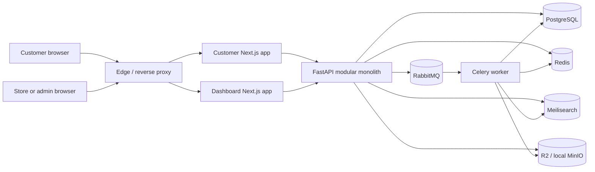

RabbitMQ is the Celery broker. Redis is restricted to caching, sessions, rate limiting, temporary reservation locks, and ephemeral coordination.

## Backend module diagram

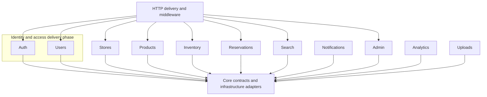

The grouping of Auth and Users represents roadmap sequencing only. Both remain explicit approved module boundaries. Modules collaborate through application services and contracts, not another module's repository internals.

## Foundation health sequence

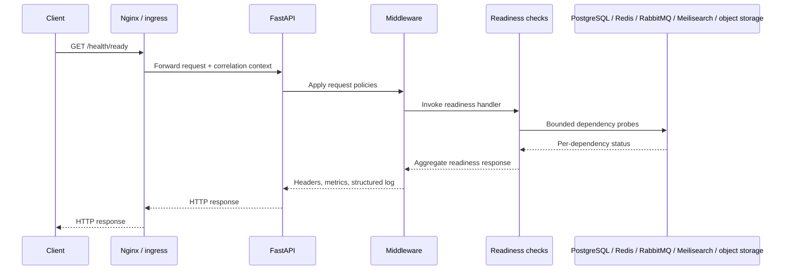

## Empty ER foundation

No business database models or migrations exist at the architecture-freeze boundary. The correct foundation ER diagram is intentionally empty:

```mermaid
erDiagram
    %% Intentionally empty at foundation-v1.
    %% Domain entities begin with approved product phases.
```

Future entity design must establish module ownership, identifiers, constraints, lifecycle rules, and migration strategy before entities are added here. This diagram must not be treated as permission to infer a business schema.

## Request flow

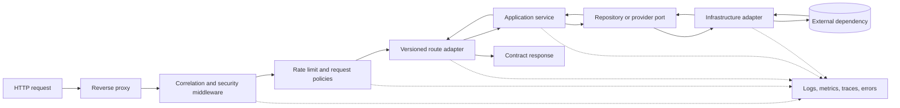

Feature routes and services are future work. The flow fixes dependency direction: HTTP and provider details remain outside domain behavior.

## Completed Identity module

The Phase 2.6 Identity implementation remains one feature module inside the
modular monolith. The branches below are capabilities, not separately deployed
services.

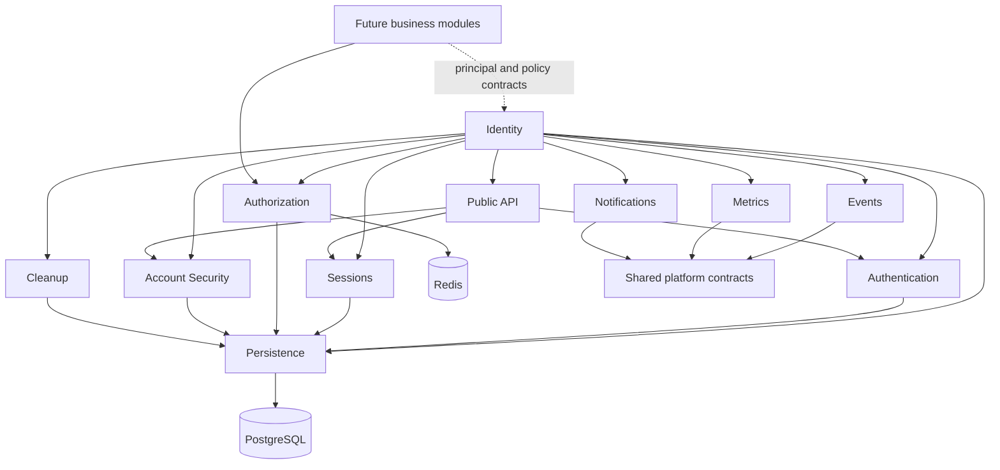

Identity does not import Store, Catalog, Inventory, Reservation, or Marketplace
packages. Its known Phase 2.4 business-vocabulary qualification and supported
interface allowlist are documented in the
[Identity Enterprise Review](identity-enterprise-review.md).

## Completed Store capabilities through Phase 3.5

The Store feature remains one bounded context and one deployable part of the
modular monolith. Its subdomains share the Store ownership boundary but expose
separate application contracts.

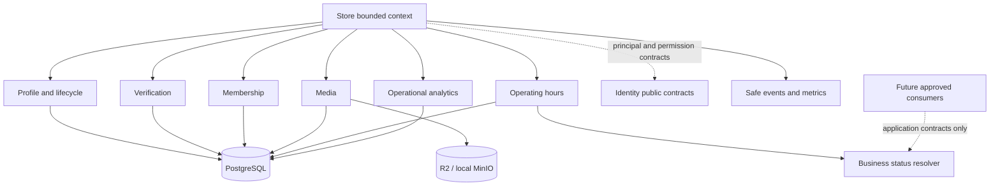

Operating hours do not represent inventory availability, reservation
capacity, delivery windows, or employee shifts. PostgreSQL remains
authoritative; the status resolver requires no Redis, RabbitMQ, search, or
background-job dependency.

Store operational analytics is a transactional PostgreSQL projection over
safe Store events. It is not a separate service, warehouse, PostHog dataset,
or business-intelligence boundary. Redis and RabbitMQ are not involved.

## Phase 3.7 Store search and discovery

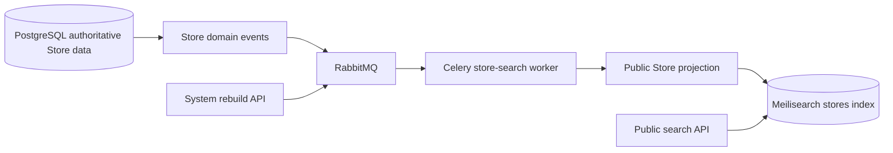

Search is a rebuildable, asynchronous projection. HTTP requests never write
Meilisearch directly. Only verified, active, public, non-deleted stores are
projected; owner, contact, membership, audit, and verification-note data is
never indexed. RabbitMQ is the Celery broker and Redis remains unrelated to
search durability.

## Phase 4.0 Catalog foundation

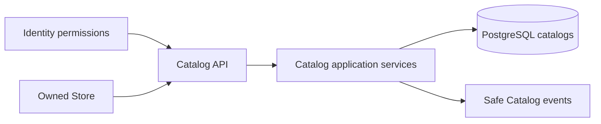

Catalog is Store-owned metadata. It has no dependency on Products, Inventory,
Pricing, Reservations, or search. PostgreSQL remains the system of record and
catalog repositories never commit transactions.

## Phase 4.1 Product foundation

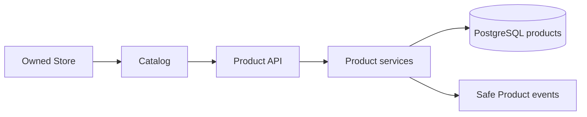

Products are Catalog-owned and Store-scoped. Product persistence does not
introduce inventory, pricing, variants, media, reservations, or new
infrastructure.

## Phase 4.3 Product Media

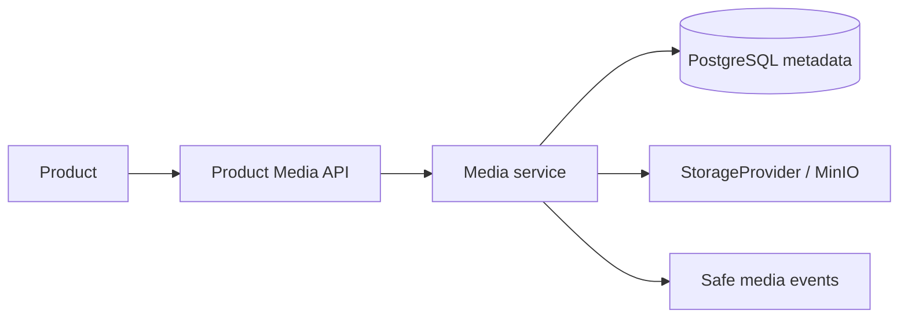

Product Media is metadata-owned by Products while binary objects remain in the
existing storage abstraction. Database transactions and compensating object
operations are coordinated by the HTTP dependency; Redis and RabbitMQ are not
used for media persistence.

## Phase 4.5 Inventory Foundation

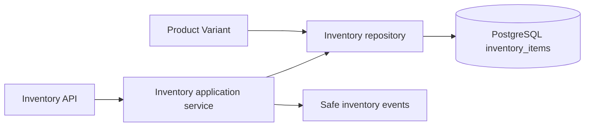

Inventory is a separate bounded context. It owns one authoritative stock record
per active Product Variant and does not own reservations, movement history,
search projections, pricing, or multi-location operations.

## Phase 4.6 Product Pricing Foundation

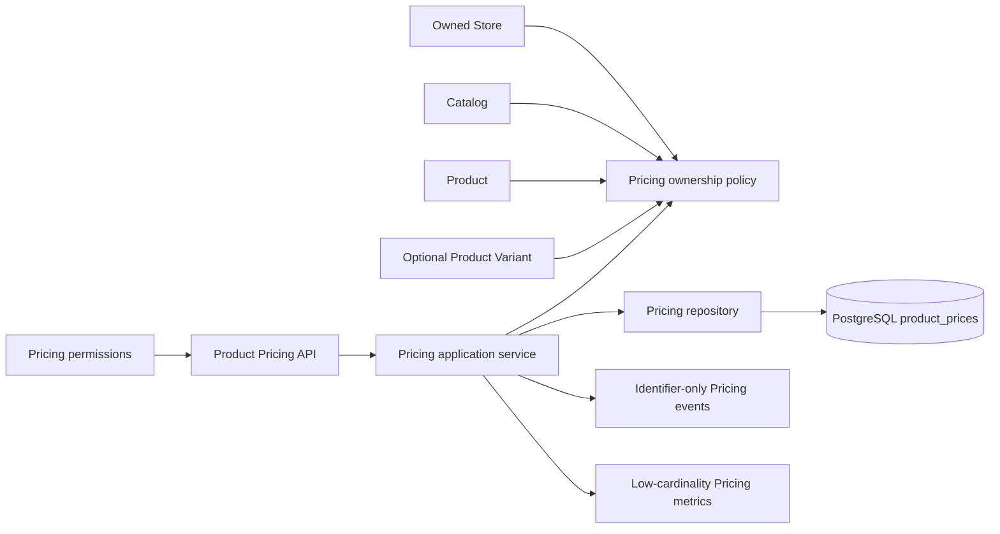

Pricing is independent from Product description and Inventory quantity. Its
application policy validates the complete Store/Catalog/Product/Variant ownership
chain, while PostgreSQL owns price constraints, effective periods, audit state,
soft deletion, and optimistic version persistence.

## Phase 4.8 Variant Attribute Normalization

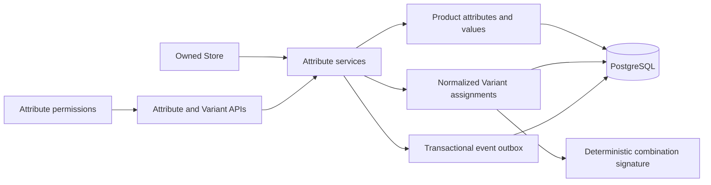

The Product Variant API remains compatible, but free-form input must resolve to
controlled values. Variant mutations and identifier-only outbox events flush in
one request transaction; dispatch and downstream projection are deferred.

## Phase 4.7 Price Lists & Multi-Currency

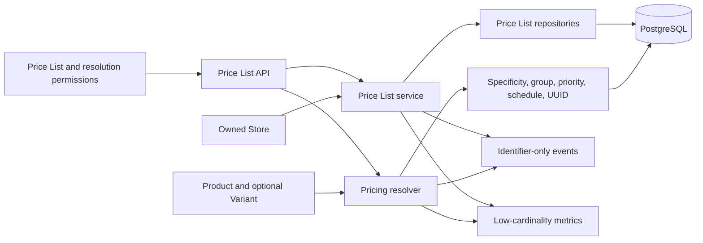

Price Lists reference authoritative Product Prices through assignments. The
resolver never converts currency: it selects only explicit records matching the
requested ISO-4217 code and timestamp. Unassigned Product Prices provide the
backward-compatible default-Store fallback.

## Phase 5.0 Shopping Cart Foundation

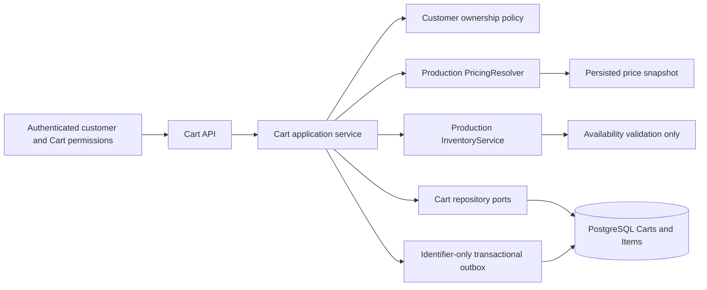

Cart reads and summaries use persisted snapshots. Pricing and Inventory are called
only when an Item is added or its quantity changes. Inventory is not reserved, and
checkout, Orders, tax, shipping, payments, conversion, and coupons remain outside
the Phase 5.0 boundary.

## Phase 5.1 Checkout Foundation

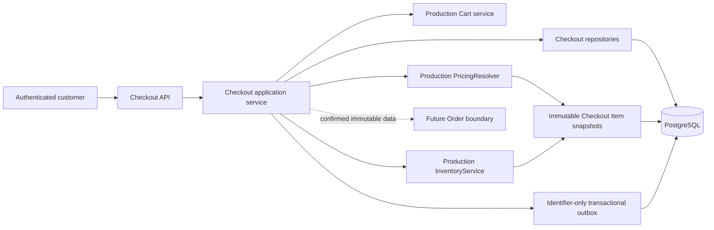

Checkout creation revalidates rather than copying Cart snapshots. Confirmation
transitions the Cart and Checkout atomically but does not reserve Inventory, create
an Order, process Payment, or calculate tax or shipping.

## Phase 5.2 Order Foundation

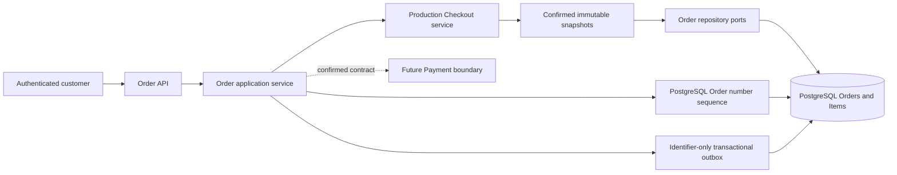

Order creation copies confirmed Checkout snapshots and never reads mutable Cart
Items. Orders do not mutate Inventory or implement Payment, tax, shipping,
invoicing, or fulfillment.

## Phase 5.3 Payment Foundation

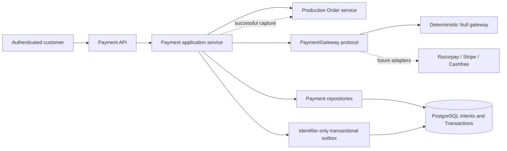

Payment snapshots a pending Order and never reads Checkout or writes Order tables.
The Null gateway performs no financial transaction. A captured Payment asks the
Order service to confirm the Order in the shared request transaction.

## Phase 5.4 Inventory Reservation

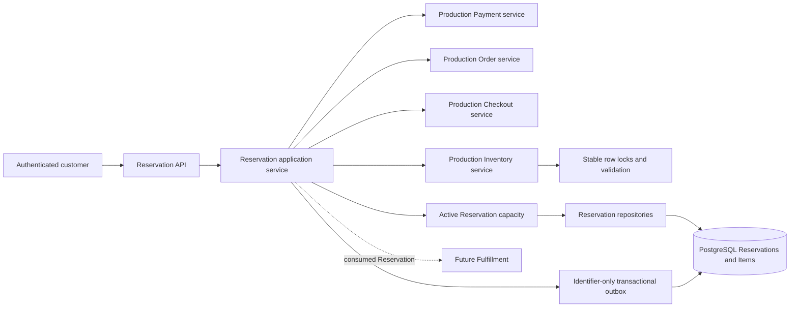

Active Reservations subtract from reservable capacity without changing Inventory
columns. Lazy expiration, release, and consumption terminate the hold; future
Fulfillment remains responsible for approved Inventory adjustment.

## Phase 5.5 Shipment & Fulfillment Foundation

```mermaid
flowchart LR
    customer[Authenticated customer] --> api[Shipment API]
    api --> service[Shipment application service]
    service --> payment[Production Payment service]
    service --> order[Production Order service]
    service --> reservation[Production Reservation service]
    service --> gateway[ShippingGateway protocol]
    gateway --> null[Deterministic Null carrier]
    service --> repositories[Shipment repositories]
    repositories --> postgres[(PostgreSQL Shipments Packages Tracking)]
    service --> inventory[Production Inventory service]
    inventory --> stock[Locked Inventory consumption]
    stock --> postgres
    service --> outbox[Identifier-only transactional outbox]
    outbox --> postgres
```

Shipment creation validates the captured commercial chain and consumed
Reservation. Dispatch changes stock only through InventoryService; Shipment owns
packages, tracking, fulfillment lifecycle, and carrier abstraction without writing
Payment, Order, Reservation, or Inventory persistence directly.

## Phase 5.6 Returns & Refund Foundation

```mermaid
flowchart LR
    customer[Purchasing customer] --> api[Return and Refund API]
    api --> service[Return application services]
    service --> order[Production Order service]
    service --> shipment[Production Shipment service]
    service --> payment[Production Payment service]
    service --> inventory[Production Inventory service validation]
    service --> repositories[Return and Refund repositories]
    repositories --> postgres[(PostgreSQL Returns Items Refunds Transactions)]
    service --> gateway[RefundGateway protocol]
    gateway --> null[Deterministic Null refund provider]
    service --> outbox[Identifier-only transactional outbox]
    outbox --> postgres
    inventory -. disposition only; no stock mutation .-> repositories
```

Returns validate immutable delivered purchase records and cumulative quantities.
Inspection persists disposition without restocking. Refunds derive immutable
commercial values and use a provider-neutral gateway without writing Payment data.
