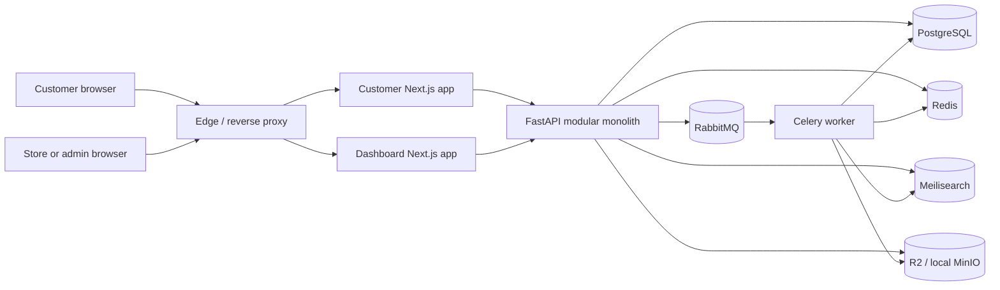
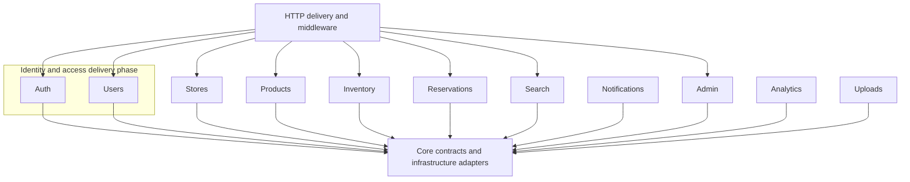
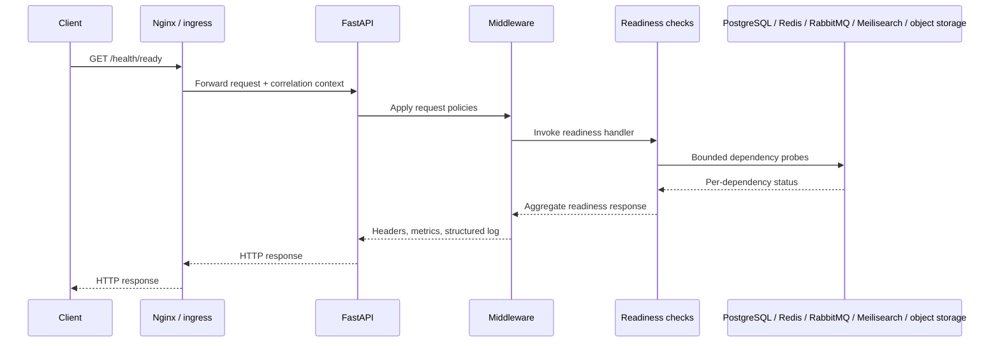
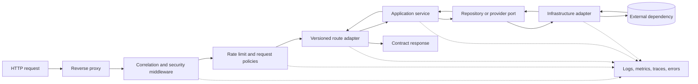
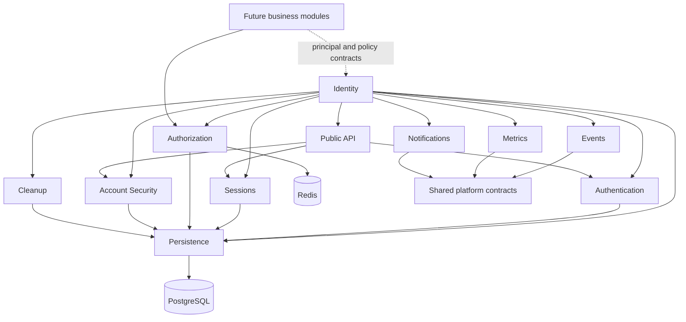
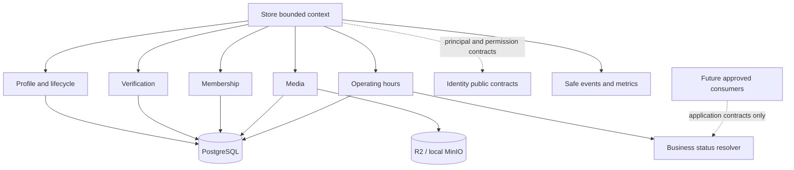

# Foundation Architecture Diagrams

These diagrams describe the frozen foundation at `foundation-v1`. They show architectural boundaries, not implemented business workflows. PostgreSQL is authoritative; Redis, Meilisearch, RabbitMQ, and object storage never replace transactional ownership.

## System architecture



RabbitMQ is the Celery broker. Redis is restricted to caching, sessions, rate limiting, temporary reservation locks, and ephemeral coordination.

## Backend module diagram



The grouping of Auth and Users represents roadmap sequencing only. Both remain explicit approved module boundaries. Modules collaborate through application services and contracts, not another module's repository internals.

## Foundation health sequence



## Empty ER foundation

No business database models or migrations exist at the architecture-freeze boundary. The correct foundation ER diagram is intentionally empty:

```mermaid
erDiagram
    %% Intentionally empty at foundation-v1.
    %% Domain entities begin with approved product phases.
```

Future entity design must establish module ownership, identifiers, constraints, lifecycle rules, and migration strategy before entities are added here. This diagram must not be treated as permission to infer a business schema.

## Request flow



Feature routes and services are future work. The flow fixes dependency direction: HTTP and provider details remain outside domain behavior.

## Completed Identity module

The Phase 2.6 Identity implementation remains one feature module inside the
modular monolith. The branches below are capabilities, not separately deployed
services.



Identity does not import Store, Catalog, Inventory, Reservation, or Marketplace
packages. Its known Phase 2.4 business-vocabulary qualification and supported
interface allowlist are documented in the
[Identity Enterprise Review](identity-enterprise-review.md).

## Completed Store capabilities through Phase 3.5

The Store feature remains one bounded context and one deployable part of the
modular monolith. Its subdomains share the Store ownership boundary but expose
separate application contracts.



Operating hours do not represent inventory availability, reservation
capacity, delivery windows, or employee shifts. PostgreSQL remains
authoritative; the status resolver requires no Redis, RabbitMQ, search, or
background-job dependency.
